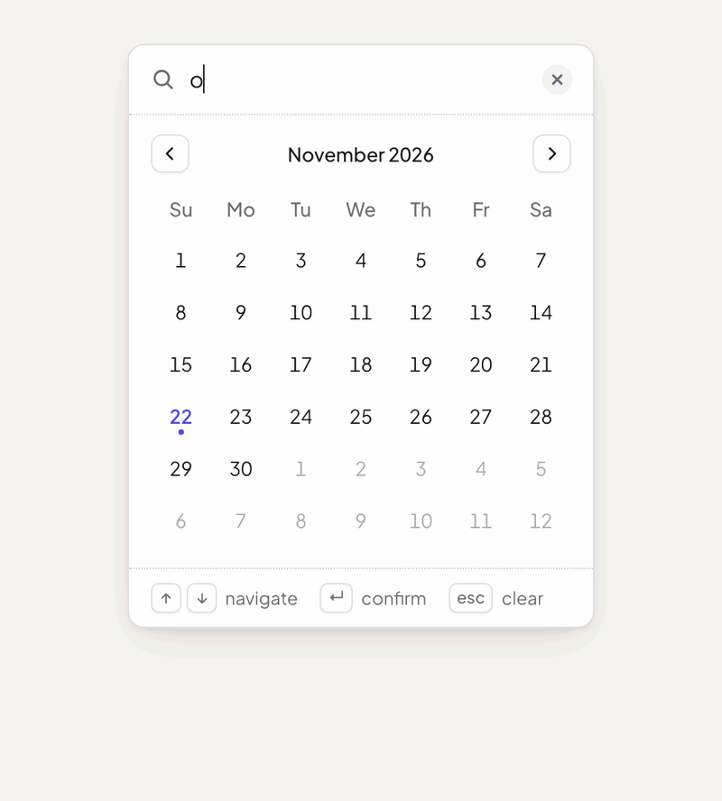

<h1 align="center">type-date</h1>

<p align="center">
A date and time picker you type into.<br>
Just type <code>oct 2 to oct 5</code> or <code>every other sunday</code> and the calendar updates in real time.
</p>

<p align="center">
  
</p>

## The idea

Most date pickers make you click through a calendar. Most natural-language date libraries return one date and give up on ranges and repeating schedules. type-date reads free text, decides whether you meant a date, a time, a range or a recurrence, and shows only the matching panels. It updates on every keystroke.

The parser has no model and no server. It is a set of rules that runs in the browser: 22 kB gzipped up front plus 40 kB of rules that load on the first keystroke, with a median of 0.3 ms per phrase.

## What it understands

| You type | It means |
|---|---|
| `oct 2 to oct 5` | Oct 2 through Oct 5 |
| `next monday 9am to 5pm` | one day, 9:00 to 17:00 |
| `every other sunday` | every 2 weeks on Sunday |
| `last friday of the month` | the last Friday of this month |
| `every weekday for two weeks` | Mon to Fri, 10 occurrences |
| `a couple weeks from next tuesday` | 2 weeks after next Tuesday |
| `thanksgiving` | 4th Thursday of November |
| `mwf 10-10:50` | Mon, Wed, Fri, 10:00 to 10:50 |
| `13th of last month` | day 13 of the previous month |
| `four score and seven years ago` | 87 years back |
| `every thrus` | every Thursday (typos and abbreviations are handled) |
| `9am tokyo time friday` | Friday 9:00 in Asia/Tokyo, with your time shown |
| `tuesdays at 1:30 and thursdays at 3` | weekly, Tue 1:30 PM and Thu 3:00 PM (a time per weekday) |
| `every third tuesday and second monday` | monthly, 2nd Monday and 3rd Tuesday |
| `every other friday until jan` | every 2 weeks on Friday, ending before Jan 1 |

## How it works

```
text  ->  parser  ->  DSL line  ->  resolver  ->  dates  ->  picker
"every other sunday"   d R w/2 su
```

1. **Parser.** Rules turn text into one line of a small DSL ([`specs/dsl.md`](specs/dsl.md)). A line is a mode (`d`, `t`, `dt`, or `x` for "not a date") and a body.
2. **Resolver.** `@type-date/core` turns the line into concrete dates relative to today.
3. **Picker.** `@type-date/picker` is a React component. The mode picks the panels. Clicking a day or time edits the result. Motion is CSS only.

The parser is separate from the picker. Any function from text to a DSL line works as `parse`.

## Results

Each generation of the parser is an engine, `h1` to `h14`. They are compared with [chrono-node](https://github.com/wanasit/chrono), a widely used rule-based parser, on the same labeled phrases. Scores are the share of phrases that resolve to the same dates as the label, on eval set `e16` (17,111 phrases). `h14` is the engine the picker ships.

| Engine | All of e16 | Personas | Voice and booking | Formats and domain | Typos | Zones, written | Zones, web | Size, gzip | Median time |
|---|---:|---:|---:|---:|---:|---:|---:|---:|---:|
| chrono-node | 31.4% | 30.7% | 36.6% | 47.7% | 7.9% | 3.5% | 33.7% | 14.9 kB | 0.01 ms |
| `h1` | 67.1% | 50.3% | 57.2% | 40.0% | 23.8% | 2.8% | 32.5% | 7.8 kB | 0.02 ms |
| `h3` | 76.5% | 71.5% | 76.3% | 54.6% | 50.9% | 13.1% | 26.9% | 10.3 kB | 0.02 ms |
| `h5` | 78.7% | 74.8% | 75.3% | 68.8% | 55.5% | 12.8% | 27.1% | 15.9 kB | 0.03 ms |
| `h8` | 84.7% | 87.0% | 83.5% | 80.0% | 90.7% | 12.6% | 34.4% | 21.9 kB + 10.7 kB lazy | 0.12 ms |
| `h11` | 85.9% | 89.6% | 93.8% | 86.9% | 91.9% | 12.6% | 34.4% | 22.1 kB + 27.9 kB lazy | 0.31 ms |
| `h12` | 87.6% | 91.4% | 93.8% | 86.9% | 92.3% | 12.6% | 34.4% | 22.2 kB + 33.7 kB lazy | 0.35 ms |
| `h13` | 92.9% | 91.4% | 93.8% | 89.2% | 93.3% | 90.4% | 94.5% | 22.3 kB + 39.9 kB lazy | 0.33 ms |
| **`h14`** | **92.9%** | **91.4%** | **93.8%** | **89.2%** | **93.3%** | **90.6%** | **94.5%** | 22.3 kB + 43.5 kB lazy | 0.34 ms |

chrono-node returns one date or one range and has no recurrence or time zone output, so it scores low on repeating schedules and zones. It is not built for typos either. Engines before `h13` ignore a time zone in the text, so their zone scores are low by design.

`h14` reads a date range with one shared time as a daily recurrence: "tomorrow to friday 3-4pm" and "3-4pm tomorrow to friday" are 3 to 4 PM on each day from tomorrow to Friday. A time on each end ("3pm tomorrow to 4pm friday") is still one span. No eval row has this shape, so its scores match `h13` (on e16 it fixes one phrase, breaks one and changes one wrong answer). See [`specs/engines/h14.md`](specs/engines/h14.md). `h13` reads the time zone in a phrase ("3pm EST", "9am PT tomorrow", "noon UTC+5:30", "10 central", "9am in Tokyo") and writes it as a last token on the result. It reads zone words next to a clock time only, so "mountain view 2pm" and "pacific rim brunch" are not zones. When a phrase gives one moment in several zones ("10:00 PST (18:00 GMT)") the first is the label. An ambiguous abbreviation such as IST or CST uses the user's zone and locale from the browser, then a default. The picker shows the zone and the time in the user's zone. Against `h12` on e16 it fixes 913 phrases and breaks 8. See [`specs/engines/h13.md`](specs/engines/h13.md). `h12` added conjunctions of recurrences ("every third tuesday and second monday", "tuesdays at 1:30 and thursdays at 3") and start and end clauses on any recurrence ([`specs/engines/h12.md`](specs/engines/h12.md)).

Where `h13` is weaker, by phrase kind (exact match, all of e16):

| Kind | Phrases | h13 |
|---|---:|---:|
| Time only | 762 | 96.6% |
| Date ranges | 1,798 | 95.4% |
| Nth weekday of a month | 274 | 96.7% |
| Time zones | 974 | 92.6% |
| Weekly recurrences | 2,741 | 93.1% |
| Relative offsets ("3 weeks from tomorrow") | 497 | 89.7% |
| Named holidays | 110 | 87.3% |
| Several nth weekdays ("every third tuesday and second monday") | 97 | 86.6% |
| Period-relative ("end of next quarter") | 186 | 83.3% |
| Recurrences with bounds ("starting in may for 10 occurrences") | 595 | 76.6% |
| A time per weekday ("tuesdays at 1:30 and thursdays at 3") | 90 | 57.8% |

### Read these numbers with care

- Labels come from two independent labeling agents. A phrase is kept only if both agree and neither is unsure. Constructs the labelers found confusing are therefore under-represented, and real input will be harder than the table.
- Part of e12 is template-generated text, which is easy. The columns Personas, Voice and booking, Formats and domain, and Typos are phrases written by other people or agents for this project. They are the better guide.
- Some remaining misses are disagreements about what a phrase means, such as "by friday" (a deadline or a date), not parser bugs.
- `h12` and `h13` were built against sets of labeled pools. On the sealed conjunction splits `h12` scores 79.1% (written by agents) and 69.2% (from web pages), against 47% and 54% for `h11`. A time per weekday is the weakest kind (57.8% on the sealed rows). On the sealed time zone splits `h13` scores 90.2% (written by agents) and 94.4% (from web pages). The written split scored 70.8% on the first run; a late fix for a zone after a single-letter meridiem ("9a pt", "3p est") raised it to 90.2%. The fix followed the first sealed score, so the second number is not independent. A third sealed set is generated from the same table the engine uses and says nothing about generalization. All of these splits are used up for tuning, so further rule work needs a new independent set.
- e14 follows a label policy change: `until` with a bare month, week, quarter or year ends the day before it starts ("every other friday until jan" stops before Jan 1), and `through` stays inclusive. e16 follows another: a time zone named in the text is part of the label (before, zones were dropped), and rows that named one were relabeled by two labelers or dropped. Scores on e14 to e16 are not comparable with earlier eval versions. Most zone mentions in the eval come from machine date strings and developer text; real typed zones are rarer and harder.
- Eval sets are versioned and immutable. Every engine is scored on every version. Each new data round is split into an open half used for tuning and a sealed half used for the next eval version.

## Run it

```sh
pnpm install
make serve          # dashboard on :5173, picker demo on :5199
```

- The **demo** (`apps/demo`) has settings for 16 color themes, week start, and time and date format.
- The **dashboard** compares engines by eval version, split and phrase kind, plots size against accuracy, and lists errors.

## Use the picker

```sh
npm install @type-date/picker react react-dom
```

```tsx
import { TypeDatePicker } from "@type-date/picker";
import "@type-date/picker/styles.css";

<TypeDatePicker onChange={console.log} />;
```

The parser (engine `h14`) is bundled in the package. The package is not published to npm yet. See [`packages/picker/README.md`](packages/picker/README.md) for props and options.

## Repository

| Path | Contents |
|---|---|
| `packages/core` | DSL types, parser and resolver |
| `packages/baselines` | engines `h1` to `h14` and chrono-node wrapper; eval scripts |
| `packages/picker` | `@type-date/picker`, the React picker with the parser bundled (the npm package) |
| `apps/demo` | The demo site, a Vite app that uses the picker |
| `apps/dashboard` | engine comparison dashboard |
| `evals/eN` | immutable eval sets |
| `data/`, `training/` | labeled pools and the Python tooling that builds data and eval sets |
| `specs/` | DSL, design, per-engine notes, research |

Earlier work tried small neural models (seq2seq, SmolLM2, Qwen). They did not meet the size and speed limits and were removed. They remain in git history.

## Status

Works well on common phrases and many unusual ones. Known gaps:

- lunar and Orthodox holidays ("ramadan" returns not a date), fiscal and academic calendars;
- recurrences with several parts: alternatives ("M or W"), a month parity written as prose, a recurrence tied to another event, and the nth-to-last weekday for any n but last;
- bounded recurrences, the weakest kind in the table;
- some typo'd clock idioms;
- a time given with a date range ("oct 2 to oct 5 at 9am") shows the dates only.

## License

MIT. See [LICENSE](LICENSE).
